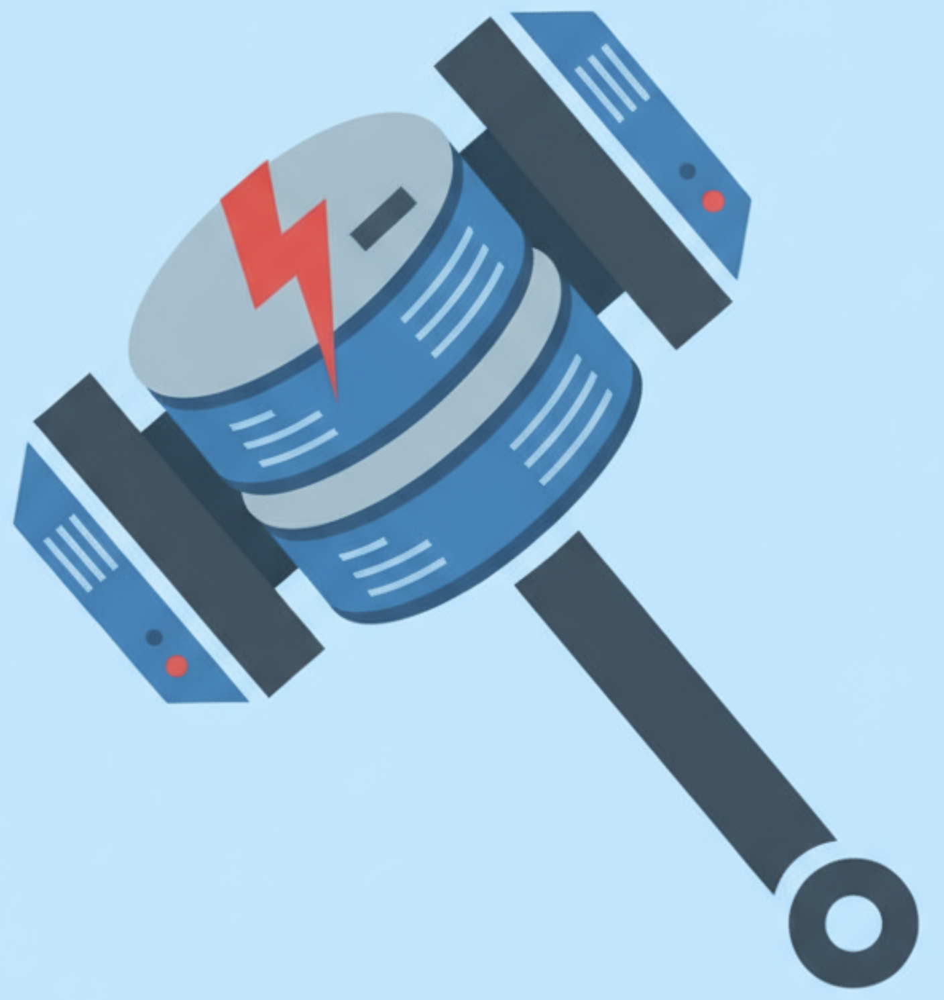

<div align="center">
  
  <h1>RAGnarōk - Agentic RAG for VS Code</h1>
  <p><strong>Production-ready local RAG with LangChain.js and intelligent query planning</strong></p>
</div>

[](https://www.typescriptlang.org/)
[](https://js.langchain.com/)
[](https://code.visualstudio.com/)

---

## 🌟 Features

### 🧠 **Agentic RAG with Query Planning**

- **Intelligent Query Decomposition**: Automatically breaks complex queries into sub-queries
- **LLM-Powered Planning**: Uses GPT-4o via VS Code LM API for advanced reasoning
- **Heuristic Fallback**: Works without LLM using rule-based planning
- **Iterative Refinement**: Confidence-based iteration for high-quality results
- **Parallel/Sequential Execution**: Smart execution strategy based on query complexity

### 🔍 **Hybrid Retrieval**

- **Vector Search**: Semantic similarity using embeddings
- **Keyword Search**: BM25-like scoring with TF-IDF
- **Fusion Strategy**: Configurable weights (default: 70% vector, 30% keyword)
- **Position Boosting**: Keywords near document start weighted higher
- **Result Explanations**: Human-readable scoring breakdown

### 📚 **Document Processing**

- **Multi-Format Support**: PDF, Markdown, HTML, plain text, GitHub repositories
- **Semantic Chunking**: Automatic strategy selection (markdown/code/recursive)
- **Structure Preservation**: Maintains heading hierarchy and context
- **Batch Processing**: Multi-file upload with progress tracking
- **GitHub Integration**: Load entire repositories from GitHub.com or GitHub Enterprise Server
- **LangChain Loaders**: Industry-standard document loading

### 💾 **Vector Storage**

- **FAISS Support**: High-performance vector search with HNSW indexing
- **Memory Fallback**: Automatic graceful degradation
- **Per-Topic Stores**: Efficient isolation and management
- **Caching**: Optimized loading and reuse

### 🎨 **Enhanced UI**

- **Configuration View**: See agentic settings at a glance
- **Statistics Display**: Documents, chunks, store type, model info
- **Progress Tracking**: Real-time updates during processing
- **Rich Icons**: Visual hierarchy with emojis and theme icons

### 🛠️ **Developer Experience**

- **Comprehensive Logging**: Debug output at every step
- **Type-Safe**: Full TypeScript with strict mode
- **Error Handling**: Robust error recovery throughout
- **Async-Safe**: Mutex locks prevent race conditions
- **Configurable**: 15+ settings for customization

---

## 🚀 Quick Start

### Installation

#### From Source

```bash
git clone https://github.com/hyorman/ragnarok.git
cd ragnarok
npm install
npm run compile
# Press F5 to run in development mode
```

#### From VSIX

```bash
code --install-extension ragnarok-0.1.0.vsix
```

### Basic Usage

#### 1. Create a Topic

```
Cmd/Ctrl+Shift+P → RAG: Create New Topic
```

Enter name (e.g., "React Docs") and optional description.

#### 2. Add Documents

```
Cmd/Ctrl+Shift+P → RAG: Add Document to Topic
```

Select topic, then choose one or more files. The extension will:

- Load documents using LangChain loaders
- Apply semantic chunking
- Generate embeddings
- Store in vector database

**Supported formats**: `.pdf`, `.md`, `.html`, `.txt`

#### 2b. Add GitHub Repository

```
Cmd/Ctrl+Shift+P → RAG: Add GitHub Repository to Topic
```

Or right-click a topic in the tree view and select the GitHub icon. You can:

- **GitHub.com or GitHub Enterprise Server**: Choose between public GitHub or your organization's GitHub Enterprise Server
- Enter repository URL:
  - GitHub.com: `https://github.com/facebook/react`
  - GitHub Enterprise: `https://github.company.com/team/project`
- Specify branch (defaults to `main`)
- Configure ignore patterns (e.g., `*.test.js, docs/*`)
- Add access token for private repositories (see [Token Management](#github-token-management) below)

The extension will recursively load all files from the repository and process them just like local documents.

**Note**: Supports GitHub.com and GitHub Enterprise Server only. The repository must be accessible from your network. For other Git hosting services (GitLab, Bitbucket, etc.), clone the repository locally and add it as local files.

#### 2c. GitHub Token Management

For accessing private repositories, RAGnarōk securely stores GitHub access tokens per host using VS Code's Secret Storage API.

**Add a Token:**

```
Cmd/Ctrl+Shift+P → RAG: Add GitHub Token
```

1. Enter the GitHub host (e.g., `github.com`, `github.company.com`)
2. Paste your GitHub Personal Access Token (PAT)
3. The token is securely stored and automatically used for that host

**List Saved Tokens:**

```
Cmd/Ctrl+Shift+P → RAG: List GitHub Tokens
```

Shows all hosts with saved tokens (tokens themselves are never displayed).

**Remove a Token:**

```
Cmd/Ctrl+Shift+P → RAG: Remove GitHub Token
```

Select a host to remove its stored token.

**How to Create a GitHub PAT:**

1. Go to GitHub Settings → Developer settings → Personal access tokens → Tokens (classic)
2. Click "Generate new token (classic)"
3. Select the `repo` scope
4. Generate and copy the token
5. Use the "RAG: Add GitHub Token" command to save it

**Benefits:**

- ✅ Tokens stored securely in VS Code's Secret Storage (not in settings.json)
- ✅ Support for multiple GitHub hosts (GitHub.com + multiple Enterprise servers)
- ✅ Automatic token selection based on repository URL
- ✅ No need to enter token every time you add a repository

#### 3. Query with Copilot

```
Open Copilot Chat (@workspace)
Type: @workspace #ragQuery What is [your question]?
```

The RAG tool will:

1. Match your topic semantically
2. Decompose complex queries (if agentic mode enabled)
3. Perform hybrid retrieval
4. Return ranked results with context

---

## ⚙️ Configuration

### Basic Settings

```json
{
  // Number of results to return
  "ragnarok.topK": 5,

  // Chunk size for splitting documents
  "ragnarok.chunkSize": 512,

  // Chunk overlap for context preservation
  "ragnarok.chunkOverlap": 50,

  // Embedding model to use
  "ragnarok.embeddingModel": "text-embedding-3-small",

  // GitHub Personal Access Token for private repositories
  "ragnarok.githubAccessToken": ""
}
```

**GitHub Access Token Setup:**

To access private repositories, you need to configure a Personal Access Token (PAT):

1. Go to GitHub → Settings → Developer settings → [Personal access tokens](https://github.com/settings/tokens)
2. Click "Generate new token (classic)"
3. Select scope: `repo` (Full control of private repositories)
4. Copy the generated token
5. Add to VS Code settings:
   - **Option 1**: `Preferences: Open Settings (JSON)` → Add `"ragnarok.githubAccessToken": "your_token_here"`
   - **Option 2**: `Preferences: Open Settings (UI)` → Search "ragnarok github" → Paste token
   - **Option 3**: Set environment variable `GITHUB_ACCESS_TOKEN`

The extension will use the configured token automatically when loading repositories.

### Agentic Mode Settings

```json
{
  // Enable agentic RAG with query planning
  "ragnarok.useAgenticMode": true,

  // Use LLM for query planning (requires Copilot)
  "ragnarok.agentic.useLLM": true,

  // Retrieval strategy: "hybrid", "vector", or "keyword"
  "ragnarok.agentic.retrievalStrategy": "hybrid",

  // Maximum refinement iterations
  "ragnarok.agentic.maxIterations": 3,

  // Confidence threshold (0-1) for stopping iteration
  "ragnarok.agentic.confidenceThreshold": 0.7,

  // Enable iterative refinement
  "ragnarok.agentic.iterativeRefinement": true,

  // LLM model for planning
  "ragnarok.agentic.llmModel": "gpt-4o",

  // Include workspace context in queries
  "ragnarok.agentic.includeWorkspaceContext": true
}
```

---

## 🏗️ Architecture

### Component Overview

```
┌─────────────────────────────────────────────────────┐
│                   VS Code Extension                 │
├─────────────────────────────────────────────────────┤
│                                                     │
│  ┌─────────────┐  ┌──────────────┐   ┌────────────┐ │
│  │ Commands    │  │ Tree View    │   │ RAG Tool   │ │
│  │ (UI)        │  │ (UI)         │   │ (Copilot)  │ │
│  └─────┬───────┘  └──────┬───────┘   └─────┬──────┘ │
│        │                 │                 │        │
│  ┌─────┴─────────────────┴─────────────────┴──────┐ │
│  │              Topic Manager                     │ │
│  │  (Topic lifecycle, caching, coordination)      │ │
│  └─────┬──────────────────────────────────┬───────┘ │
│        │                                  │         │
│  ┌─────┴─────────┐                 ┌──────┴───────┐ │
│  │ Document      │                 │ RAG Agent    │ │
│  │ Pipeline      │                 │ (Orchestr.)  │ │
│  └┬─────────┬────┘                 └┬─────────┬───┘ │
│   │         │                       │         │     │
│ ┌─┴────┐ ┌──┴────┐           ┌──────┴──┐ ┌────┴───┐ │
│ │Loader│ │Chunker│           │ Planner │ │Retriev.│ │
│ │      │ │       │           │         │ │        │ │
│ └──┬───┘ └───┬───┘           └────┬────┘ └───┬────┘ │
│    │         │                    │          │      │
│  ┌─┴─────────┴────┐          ┌────┴──────────┴────┐ │
│  │ Embedding      │          │ Vector Store       │ │
│  │ Service        │          │ (FAISS/Memory)     │ │
│  └────────────────┘          └────────────────────┘ │
│                                                     │
└─────────────────────────────────────────────────────┘
                          │
                   ┌──────┴───────┐
                   │ LangChain.js │
                   │ (Foundation) │
                   └──────────────┘
```

### Core Components

#### **TopicManager** (`managers/topicManager.ts`)

- Topic lifecycle management (CRUD operations)
- Vector store per topic with caching
- Coordinates document processing
- Statistics and metadata tracking

#### **DocumentPipeline** (`managers/documentPipeline.ts`)

- End-to-end document processing
- Load → Chunk → Embed → Store
- Progress callbacks for UI
- Error recovery and retry logic

#### **RAGAgent** (`agents/ragAgent.ts`)

- Main orchestrator for queries
- Coordinates planner and retriever
- Iterative refinement loop
- Result deduplication and ranking

#### **QueryPlannerAgent** (`agents/queryPlannerAgent.ts`)

- Query complexity analysis
- LLM-powered decomposition
- Heuristic fallback planning
- Structured output with Zod schemas

#### **HybridRetriever** (`retrievers/hybridRetriever.ts`)

- Vector + keyword search fusion
- BM25-like scoring algorithm
- Configurable weights
- Result explanation generation

#### **VectorStoreFactory** (`stores/vectorStoreFactory.ts`)

- FAISS and Memory vector store support
- Automatic fallback handling
- Persistence and caching
- Store lifecycle management

#### **DocumentLoaderFactory** (`loaders/documentLoaderFactory.ts`)

- Multi-format document loading
- LangChain loader integration
- Metadata enrichment
- Batch processing support

#### **SemanticChunker** (`splitters/semanticChunker.ts`)

- Automatic strategy selection
- Markdown-aware splitting
- Code-aware splitting
- Heading hierarchy preservation

---

## 🔧 API Reference

### TopicManager

```typescript
// Get singleton instance
const topicManager = TopicManager.getInstance();

// Create topic
const topic = await topicManager.createTopic({
  name: "My Topic",
  description: "Optional description",
  embeddingModel: "text-embedding-3-small", // optional
});

// Add documents
const results = await topicManager.addDocuments(
  topic.id,
  ["/path/to/doc1.pdf", "/path/to/doc2.md"],
  {
    onProgress: (progress) => {
      console.log(`${progress.stage}: ${progress.progress}%`);
    },
  }
);

// Get topic stats
const stats = await topicManager.getTopicStats(topic.id);
// { documentCount, chunkCount, vectorStoreType, embeddingModel, lastUpdated }

// Delete topic
await topicManager.deleteTopic(topic.id);
```

### RAGAgent

```typescript
// Create agent
const agent = new RAGAgent();
const vectorStore = await topicManager.getVectorStore(topicId);
await agent.initialize(vectorStore);

// Agentic query
const result = await agent.query("How do I use React hooks?", {
  topK: 5,
  enableIterativeRefinement: true,
  maxIterations: 3,
  confidenceThreshold: 0.7,
  useLLM: true,
  retrievalStrategy: "hybrid",
});

// Simple query (bypasses planning)
const results = await agent.simpleQuery("React hooks", 5);
```

### HybridRetriever

```typescript
// Create retriever
const retriever = new HybridRetriever();
retriever.setVectorStore(vectorStore);

// Hybrid search
const results = await retriever.search("React hooks", {
  k: 5,
  vectorWeight: 0.7,
  keywordWeight: 0.3,
  minSimilarity: 0.3,
});

// Vector-only search
const vectorResults = await retriever.vectorSearch("React hooks", 5);

// Keyword-only search
const keywordResults = await retriever.keywordSearch("React hooks", 5);
```

---

## 🎯 How It Works

### Agentic Query Flow

```
User Query: "Compare React hooks vs class components"
    ↓
┌───┴────────────────────────────────────────┐
│ 1. Topic Matching (Semantic Similarity)    │
│    → Finds best matching topic             │
└───┬────────────────────────────────────────┘
    ↓
┌───┴────────────────────────────────────────┐
│ 2. Query Planning (LLM or Heuristic)       │
│    Complexity: complex                     │
│    Sub-queries:                            │
│    - "React hooks features and usage"      │
│    - "React class components features"     │
│    Strategy: parallel                      │
└───┬────────────────────────────────────────┘
    ↓
┌───┴────────────────────────────────────────┐
│ 3. Hybrid Retrieval (for each sub-query)   │
│    Vector search: 70% weight               │
│    Keyword search: 30% weight              │
│    → Returns ranked results                │
└───┬────────────────────────────────────────┘
    ↓
┌───┴────────────────────────────────────────┐
│ 4. Iterative Refinement (if enabled)       │
│    Check confidence: 0.65 < 0.7            │
│    → Refine query and retrieve again       │
│    Check confidence: 0.78 ≥ 0.7 ✓          │
└───┬────────────────────────────────────────┘
    ↓
┌───┴────────────────────────────────────────┐
│ 5. Result Processing                       │
│    - Deduplicate by content hash           │
│    - Rank by score                         │
│    - Limit to topK                         │
└───┬────────────────────────────────────────┘
    ↓
Return: Ranked results with metadata
```

### Document Processing Flow

```
User uploads: document1.pdf, document2.md
    ↓
┌───┴────────────────────────────────────────┐
│ 1. Document Loading (LangChain Loaders)    │
│    PDF: PDFLoader                          │
│    MD: TextLoader                          │
│    HTML: CheerioWebBaseLoader              │
│    → Returns Document[] with metadata      │
└───┬────────────────────────────────────────┘
    ↓
┌───┴────────────────────────────────────────┐
│ 2. Semantic Chunking                       │
│    Strategy selection:                     │
│    - Markdown: MarkdownTextSplitter        │
│    - Code: RecursiveCharacterTextSplitter  │
│    - Other: RecursiveCharacterTextSplitter │
│    → Preserves headings and structure      │
└───┬────────────────────────────────────────┘
    ↓
┌───┴────────────────────────────────────────┐
│ 3. Embedding Generation (Batched)          │
│    Model: text-embedding-3-small           │
│    Batch size: 32 chunks                   │
│    → Generates 1536-dim vectors            │
└───┬────────────────────────────────────────┘
    ↓
┌───┴────────────────────────────────────────┐
│ 4. Vector Storage                          │
│    Auto-select: FAISS (>1000) or Memory    │
│    → Stores embeddings + metadata          │
└───┬────────────────────────────────────────┘
    ↓
Complete: Documents ready for retrieval
```

---

## 📊 Performance

### Benchmarks (M1 Mac, 16GB RAM)

| Operation                       | Time   | Notes                  |
| ------------------------------- | ------ | ---------------------- |
| Load PDF (10 pages)             | ~2s    | Using PDFLoader        |
| Chunk document (50 chunks)      | ~100ms | Semantic chunking      |
| Generate embeddings (50 chunks) | ~5s    | Batched, local model   |
| Store in FAISS                  | ~50ms  | Including save to disk |
| Hybrid search (k=5)             | ~100ms | Vector + keyword       |
| Query planning (LLM)            | ~2s    | GPT-4o via Copilot     |
| Query planning (heuristic)      | <10ms  | Rule-based             |

### Optimization Tips

1. **Use FAISS for large datasets** (>1000 chunks)
2. **Enable agent caching** (automatic per topic)
3. **Adjust chunk size** based on document type
4. **Use simple mode** for fast queries
5. **Batch document uploads** for efficiency

---

## 🐛 Troubleshooting

### Common Issues

#### Extension not activating

```
Check: VS Code version ≥ 1.90
Check: Output → RAGnarōk for logs
Solution: Reload window (Cmd/Ctrl+R)
```

#### No embeddings generated

```
Check: Internet connection (for downloading model)
Check: Disk space (model cache ~200MB)
Solution: Clear cache and retry
```

#### Slow query performance

```
Check: Vector store type (use FAISS for >1000 chunks)
Check: Agentic mode settings (disable if not needed)
Solution: Adjust topK and confidence threshold
```

#### RAG tool not visible in Copilot

```
Check: GitHub Copilot extension installed
Check: Copilot subscription active
Check: VS Code version ≥ 1.90
Solution: Restart VS Code
```

---

## 🔬 Testing

### Run Tests

```bash
npm test
```

### Test Coverage

- Unit tests: 80%+ coverage target
- Integration tests: Key workflows
- Manual testing: UI and commands

---

## 🤝 Contributing

We welcome contributions! Please see [CONTRIBUTING.md](CONTRIBUTING.md) for guidelines.

### Development Setup

```bash
git clone https://github.com/hyorman/ragnarok.git
cd ragnarok
npm install
npm run watch  # Watch mode for development
```

### Project Structure

```
src/
├── agents/         # Agentic RAG components
├── retrievers/     # Retrieval strategies
├── managers/       # High-level managers
├── loaders/        # Document loaders
├── splitters/      # Text splitters
├── stores/         # Vector stores
├── utils/          # Utilities (Logger, etc.)
├── commands.ts     # VS Code commands
├── extension.ts    # Extension entry point
├── ragTool.ts      # Copilot tool
└── topicTreeView.ts # Tree view provider
```

---

## 📄 License

MIT License - see [LICENSE](LICENSE) for details

---

## 🙏 Acknowledgments

Built with:

- [LangChain.js](https://js.langchain.com/) - Document processing framework
- [Transformers.js](https://huggingface.co/docs/transformers.js) - Local embeddings
- [FAISS](https://github.com/facebookresearch/faiss) - Vector search
- [VS Code Extension API](https://code.visualstudio.com/api) - Extension platform

---

## 📞 Support

- 📧 Email: support@example.com
- 💬 Discord: [Join our community](https://discord.gg/example)
- 🐛 Issues: [GitHub Issues](https://github.com/hyorman/ragnarok/issues)
- 📖 Docs: [Full documentation](https://ragnarok.dev/docs)

---

<div align="center">
  <p>Made with ❤️ by the RAGnarōk team</p>
  <p>⭐ Star us on GitHub if you find this useful!</p>
</div>
